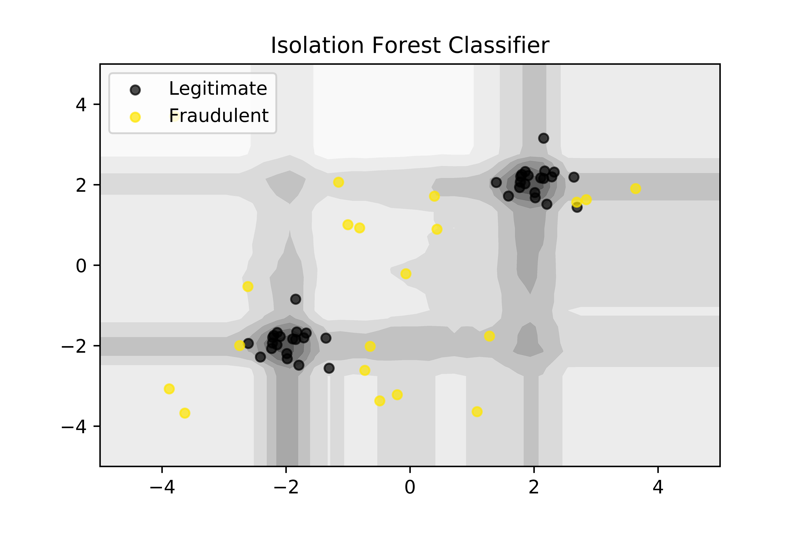

# Isolation Forest Classifier to Classify Credit Card Fraud

It is important that credit card companies are able to recognize fraudulent credit card transactions so that customers are not charged for items that they did not purchase.

The Isolation forest algorithm segregates observations by randomly selecting a feature and then randomly selecting a split value between the maximum and minimum values of selected feature similarly constructing the separation by creating random decision trees. 
Thus, an anomaly score is calculated as the number of conditions required to separate a given observation.

